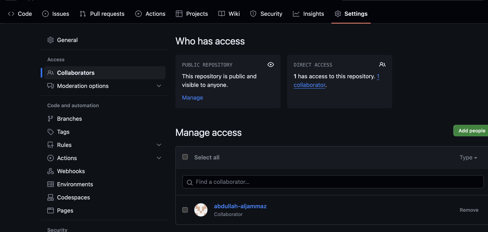

<!DOCTYPE html>
<html lang="en">
<head>
    <meta charset="UTF-8">
    <meta http-equiv="X-UA-Compatible" content="IE=edge">
    <meta name="viewport" content="width=device-width, initial-scale=1.0">
</head>
<body>
    <h1>Backend Course</h1>
    <h3>Day 7</h3>
    

    <h4>Today we learned about:</h4>
    
We took Git and Github we learned how to add collaborators

    

</html>